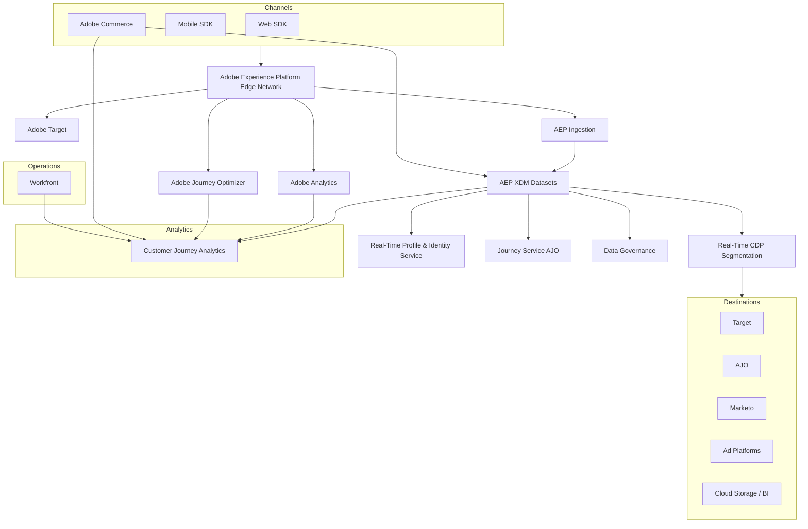
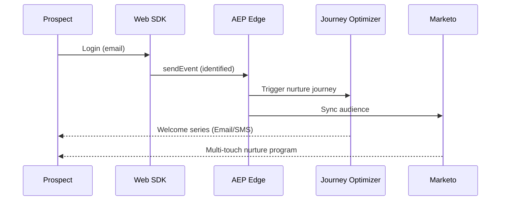
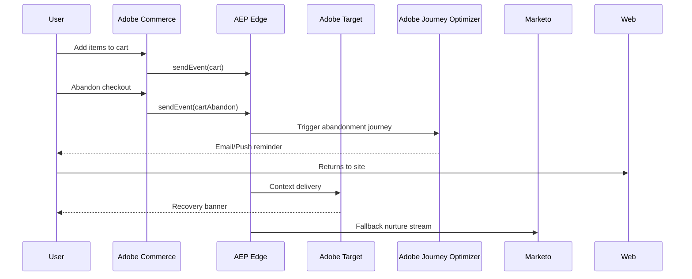

# Adobe DX Suite End-to-End Integration (POC) – Blueprint

---

>
> Scope: Web + (optional) Mobile app, integrating Adobe Analytics (AA), Adobe Target (AT), Adobe Experience Platform (AEP), Real-Time CDP (RT-CDP), Customer Journey Analytics (CJA), Adobe Journey Optimizer (AJO), Marketo Engage (MKT), Adobe Commerce (AC), and Workfront (WF).
> Method: Use-case driven POC that is production-sane but safely isolated.
>

---

## 1) Objectives & Success Criteria

**Primary objectives**

* Prove a unified, privacy-safe data foundation using AEP + Web SDK (Edge Network).
* Activate real-time audiences to personalization (Target), campaigns (AJO), and marketing (Marketo) across channels.
* Build end-to-end analytics with CJA for cross-channel insights (web, commerce, campaigns, journeys).
* Demonstrate measurable lift for at least two use cases (e.g., conversion, engagement, revenue per visitor).

**Success criteria**

* Audiences: segment qualification < 5 minutes for streaming conditions; batch audiences refreshing daily.
* Target personalization fed by AEP profile attributes; AJO campaigns triggered via real-time decisions.
* CJA dashboards stitch cross-channel data (AA, AJO, Commerce, Marketo).
* Marketo program receives AEP audiences via destination and triggers nurture emails.
* Workfront orchestrates workflows with SLAs and approvals.

---

## 2) Reference Architecture (POC)

---

## 3) Use Cases

### UC1: First-time visitor → account creation boost

* **Trigger**: Visitor browses ≥3 PDPs.
* **Action**: AT banner promoting sign-up.
* **Audience**: RT-CDP streaming segment `HighIntent_NewVisitor`.
* **Outcome**: +X% sign-ups.

### UC2: Known prospect nurtured to first purchase

* **Trigger**: Known visitor (email identified).
* **Action**: AJO journey triggers welcome series across email/SMS; Marketo adds nurture stream.
* **Measurement**: CJA shows uplift in purchase conversion.

### UC3: Abandoned cart recovery

* **Signal**: Commerce event `cartAbandon`.
* **Action**: AT recovery banner on revisit + AJO triggered push/email journey; Marketo fallback nurture.
* **KPIs**: Cart recovery % and revenue uplift.

### UC4: Post-purchase cross-sell journey

* **Audience**: `Purchased_Core_Product` but `No_Addon`.
* **Action**: AJO journey triggers upgrade offer email + AT homepage personalization.

### UC5: Lead-to-Customer Acceleration with Marketo

* **Trigger**: AEP identifies a qualified prospect (via behavioral + commerce signals).
* **Action**: Audience automatically sent to Marketo → enrolled in a multi-touch nurture program.
* **Integration**: Sync back to AEP for profile enrichment; CJA measures lead velocity.
* **KPI**: Reduction in lead-to-customer conversion time.

### UC6: Campaign & Workflow Orchestration with Workfront

* **Trigger**: Marketing team requests a new campaign (via Workfront form).
* **Action**: Auto-create tasks for content, creative, targeting in AT/AJO/Marketo.
* **Integration**: Workfront integrates with AEP schemas for campaign metadata → used in reporting.
* **KPI**: Time saved per campaign launch.

---

## 4) Step-by-Step Plan of Action

### Phase 1 – Foundations (Week 1–2)

1. **Provision sandboxes**: AEP (`POC-Demo`).
2. **Configure datastreams**: route to AA, Target, AJO, AEP.
3. **Create schemas** in AEP: Profile + ExperienceEvent (web + commerce).
4. **Enable datasets** for profile.

### Phase 2 – Identity & Ingestion (Week 3–4)

1. Configure identity namespaces: ECID (primary), Email (hashed - maybe).
2. Implement Web SDK on sample site (track page, PDP, cart, checkout).
3. Connect Adobe Commerce → AEP via API.
4. Integrate Marketo connector → ingest leads + activities.
5. Enable AJO connection in AEP.

### Phase 3 – Activation (Week 5–6)

1. Build RT-CDP segments (UC1–UC6).
2. Share audiences to Target, AJO, Marketo.
3. Configure AT activities (A/B + XT).
4. Configure AJO journeys:

   * UC1: Trigger email after sign-up.
   * UC2: Welcome journey (multi-step).
   * UC3: Cart abandonment journey with wait + reminder.
   * UC4: Cross-sell journey.
   * UC5: Nurture program via Marketo.
   * UC6: Campaign launch workflow triggered in Workfront.

### Phase 4 – Analytics & CJA (Week 7–8)

1. Create AA report suite `AA_POC_DEV`.
2. Set up CJA **Connections**: ingest AEP, AA, AJO, Commerce datasets.
3. Define **Data Views**: unify across identityMap.
4. Build initial dashboards for UC KPIs.

### Phase 5 – Launch & QA (Week 9)

1. Run UC1/UC3 activities live.
2. Validate AJO triggers fire in real-time.

### Phase 6 – Iteration & Demo (Week 9–10)

1. Optimize experiments.
2. Document lessons + KPIs.
3. Create demo script per UC for customer presentations.

---

## 5) Example CJA Dashboards

### Dashboard 1 – Conversion Funnel

* Steps: PDP Views → Cart Adds → Checkout → Purchase.
* Breakdown: by AEP Segment (UC1/UC2/UC3).
* KPI: Funnel completion %.

### Dashboard 2 – Audience Performance

* Metrics: Audience size vs. conversion rate vs. revenue.
* Breakdown: `HighIntent_NewVisitor`, `Prospect_NoPurchase_30d`, `Cart_Abandon`.
* Visualization: bar chart of lift.

### Dashboard 3 – Cross-Channel Journey

* Data sources: Web (AA), Commerce, AJO, Marketo.
* Panel: Sankey flow of touchpoints (web → email → purchase).
* KPI: Time to conversion.

### Dashboard 4 – Experiment Results

* Source: AT experiment data + purchase revenue.
* View: Lift chart (control vs. variant).
* KPI: Sign-up lift, revenue lift.

### Dashboard 5 – Engagement & Retention

* Metrics: Repeat visitors, AJO campaign engagement, repurchase rate.
* Visualization: Cohort analysis heatmap.

---

## 6) Demo Flows

### UC1 & UC2 Demo Flow

1. Browse ≥3 PDPs as new visitor → AT banner shown.
2. Submit sign-up form → AJO welcome journey email triggered instantly.
3. CJA shows visitor stitched and conversion uplift.

### UC3 Demo Flow

1. Add items to cart → abandon.
2. Within 1h → AT recovery banner; AJO abandonment email journey triggered.
3. Return, complete purchase → CJA dashboard shows recovered revenue.

### UC5 Demo Flow

1. AEP qualifies user as high-intent prospect.
2. Segment shared to Marketo → nurture program triggered.
3. Prospect engages with nurture → CRM sync; CJA dashboard shows reduced lead-to-customer time.

### UC6 Demo Flow

1. Marketing submits new campaign request in Workfront.
2. Workflow auto-creates tasks in AT/AJO/Marketo.
3. Campaign assets approved → deployed; CJA + Workfront reports show reduced launch time.

---

*End*
